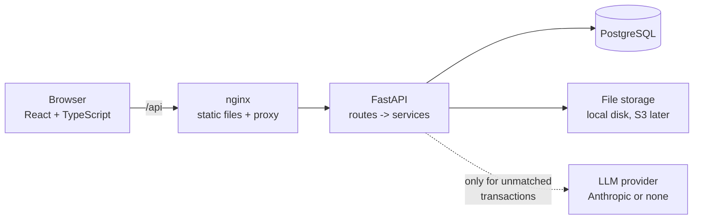
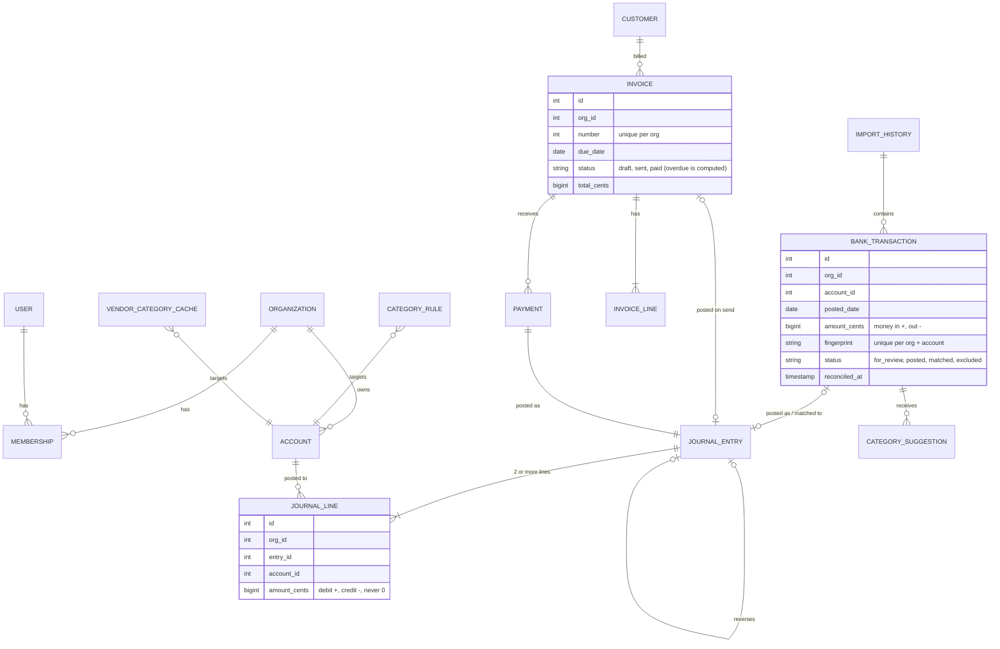

# SmartBudget

Double-entry bookkeeping for freelancers and very small businesses: import bank statements,
categorize transactions (rules first, an LLM only for what's left), send invoices, track what
customers owe, reconcile against the bank, and read a profit & loss, balance sheet and cash
flow built straight from the ledger.

Built as a portfolio project to practice the parts of accounting software that have to be
exactly right: money precision, a ledger that always balances, idempotent imports and strict
tenant isolation. Product ideas are inspired by mainstream small-business accounting tools;
no code, text or branding is copied from them.


## What it does

- **Chart of accounts and ledger.** Every financial event is a journal entry whose lines sum
  to zero. Posted entries can't be edited or deleted; mistakes are fixed with reversing
  entries.
- **Bank CSV import.** Column mapping with a preview, a per-row error report, vendor name
  cleanup, and duplicate detection: importing the same file again adds nothing.
- **Categorization.** User rules (e.g. description contains "aws" -> Software), then a
  per-organization vendor cache, then an LLM for anything still unmatched. Nothing is posted
  until a person accepts it. Acceptance rate is tracked per source.
- **Invoices and accounts receivable.** Drafts, sending (posts to AR and income), partial
  payments, computed overdue status, and an AR aging report that ties out to the ledger.
- **Reports.** Profit & loss, balance sheet and cash flow summary for any dates, computed with
  SQL aggregation over the ledger.
- **Reconciliation.** Match bank lines to entries already in the ledger (no double counting),
  compare a statement balance with the ledger, and list what explains the difference.
- **Multi-tenant.** Every row belongs to an organization; users only see organizations they
  are members of.

| Review queue | Invoices and AR aging |
| --- | --- |
|  |  |

## Architecture



The backend is layered so business rules live in one place:

- `app/api/` - HTTP only: parse the request, call a service, shape the response. One
  dependency, `get_org_context`, checks organization membership for every org-scoped route.
- `app/services/` - all business logic. `ledger_service.record_entry` is the only code that
  creates journal entries; bank categorization, invoices and payments all go through it.
  Services raise plain Python errors, which `app/main.py` maps to HTTP status codes.
- `app/models/` - SQLAlchemy 2.0 models; `app/schemas/` - Pydantic request/response bodies.
- `alembic/` - migrations; the test suite applies them to a real Postgres on every run.

Storage and the LLM sit behind small interfaces (`FileStorage`, `CategorySuggester`), so the
planned AWS deployment (S3 for uploads, Secrets Manager for keys) means adding
implementations, not changing the import or categorization code.

## Data model



Every table except `users` has an `org_id`; the full column list is in `backend/app/models/`.

## Quick start

Requirements: Docker.

```bash
docker compose up --build -d
docker compose exec api python -m app.scripts.seed
```

- App: http://localhost:8080, log in as `demo@smartbudget.dev` / `demo-password` (a local
  demo account created by the seed script).
- Interactive API docs: http://localhost:8080/api/docs

### Local development

Requirements: Python 3.11+, Node 22, Docker (for Postgres).

```bash
docker compose up -d --wait db                       # dev Postgres on port 5434
docker compose --profile test up -d --wait db_test   # test Postgres on port 5435

cd backend
python3 -m venv .venv && source .venv/bin/activate
pip install -e ".[dev]"
cp .env.example .env              # then set JWT_SECRET_KEY
alembic upgrade head
python -m app.scripts.seed        # optional demo data
uvicorn app.main:app --reload     # API docs: http://localhost:8000/api/docs

cd ../frontend
npm install
npm run dev                       # http://localhost:5173 (proxies /api to :8000)
```

### Tests and checks

```bash
cd backend && ruff check . && ruff format --check . && pytest
cd frontend && npm test && npm run build
```

GitHub Actions runs the same checks on every push, plus a Docker build of both images. The
backend suite has 153 tests, including a tenancy-isolation test for each resource type, and
the frontend has 17 unit tests for the money helpers. Tests never call a real LLM: they use a
fake provider.

### LLM suggestions (optional)

Off by default. To enable, set `LLM_PROVIDER=anthropic` and `ANTHROPIC_API_KEY` (and
optionally `LLM_MODEL`, default `claude-opus-5`). Only a transaction's description, cleaned
vendor name and direction (in/out) are sent, never amounts. The model's answers are validated:
only accounts of the same organization that can hold a category are accepted.

## API overview

All routes are under `/api/v1`. Everything except auth is scoped to an organization:
`/api/v1/orgs/{org_id}/...`. Amounts are integer cents.

| Area | Endpoints |
| --- | --- |
| Auth | `POST /auth/signup`, `POST /auth/login`, `GET /auth/me` |
| Organizations | `GET/POST /orgs`, `GET /orgs/{org_id}` |
| Accounts | `GET/POST /accounts`, `PATCH /accounts/{id}`, `GET /accounts/{id}/balance`, `GET /trial-balance` |
| Journal | `GET/POST /journal-entries`, `GET /journal-entries/{id}`, `POST /journal-entries/{id}/reverse` |
| Import | `POST /imports/preview`, `POST /imports`, `GET /imports`, `GET /imports/{id}`, `GET /bank-transactions` |
| Categorization | `GET/POST /rules`, `PATCH/DELETE /rules/{id}`, `POST /bank-transactions/suggest`, `GET /suggestions`, `GET /suggestions/stats`, `POST /suggestions/{id}/accept`, `POST /suggestions/{id}/reject`, `POST /bank-transactions/{id}/categorize`, `POST /bank-transactions/{id}/exclude` |
| Invoicing | `GET/POST /customers`, `GET/PATCH /customers/{id}`, `GET/POST /invoices`, `GET/PATCH/DELETE /invoices/{id}`, `POST /invoices/{id}/send`, `POST /invoices/{id}/payments`, `GET /reports/ar-aging` |
| Reports | `GET /reports/profit-loss`, `GET /reports/balance-sheet`, `GET /reports/cash-flow`, `GET /reports/monthly` |
| Reconciliation | `GET /bank-transactions/{id}/match-candidates`, `POST /bank-transactions/{id}/match`, `POST /bank-transactions/{id}/unmatch`, `GET /reconciliation`, `POST /reconciliation/complete` |

A user who isn't a member of an organization gets `404` for its URLs (not `403`), so
organization ids can't be probed.

## Design decisions

The short version; [docs/decisions.md](docs/decisions.md) has the full log, stage by stage,
with the alternatives considered and the tradeoffs.

**Double-entry with one signed amount.** A journal line stores `amount_cents`: positive for a
debit, negative for a credit. "Balanced" means the lines sum to exactly 0, and every report is
a plain `SUM ... GROUP BY`. `ledger_service.validate_lines` requires at least two lines, no
zero lines, a zero sum, and accounts that belong to the organization and are active. It is
the only path into the ledger. Posted entries are immutable: there are no update or delete
routes, an ORM guard raises if code tries anyway, and corrections are reversing entries (each
entry can be reversed once, enforced by a unique constraint).

**Money as integer cents.** `BIGINT` in Postgres, `int` in Python, `StrictInt` in the API
(so `12.5` is rejected rather than converted), `Decimal` when parsing CSV amounts (more than
two decimals is an error, not a rounding), and string and integer math in the browser.
Invoice lines multiply a decimal quantity by a price in cents and round half-up once per line.

**Idempotent imports.** Each row gets a fingerprint from account, date, amount, lightly
normalized description and an occurrence number (the Nth identical row in the file). A
unique constraint plus `INSERT ... ON CONFLICT DO NOTHING` lets the database skip rows that
already exist, which also holds when two uploads race. The occurrence number keeps two real
$4.50 coffees on the same day, which a plain date + amount + description key would drop.

**Tenancy.** The organization is in the URL, one dependency checks membership, and every
service query filters by `org_id`. References across organizations (posting to another org's
account, billing its customer, matching its ledger entry) are rejected.
`backend/tests/test_tenancy.py` covers each resource type.

**Concurrency.** Row locks (`SELECT ... FOR UPDATE`) stop a bank transaction from being
posted twice and stop two payments from overpaying an invoice. Unique constraints catch
duplicate reversals, duplicate matches and invoice-number races.

## Challenges I hit

- **The obvious duplicate check dropped real transactions.** The older project I started from
  deduplicated on date + amount + description, which silently drops two identical purchases on
  the same day. Adding an occurrence number fixed that but introduced a known edge case: if one
  export cuts off mid-day and the next includes the whole day, the numbering can shift. It is
  documented rather than hidden.
- **Two normalizations, not one.** Using the aggressive vendor cleanup (strip store numbers and
  long digit runs) for the fingerprint would have made `CHECK #1041` and `CHECK #1042`
  duplicates. The fingerprint uses only case and whitespace cleanup; the vendor cleanup is used
  only for rules and the cache.
- **The balance sheet didn't balance at first.** Without year-end closing entries, profit to
  date sits in income and expense accounts, so assets didn't equal liabilities plus equity.
  The report now shows "current earnings" in equity, and a test checks the balance on several
  dates.
- **Tests that depended on today's date.** Invoice tests with fixed due dates started failing
  once the real date passed them, because "overdue" is computed at read time. Tests now pass
  dates explicitly, and the AR aging takes an `as_of` date, which also made it possible to test
  it against the ledger balance on the same day.
- **Clicking through the UI found a double-counting path the tests didn't.** The review queue
  only offered "Post", so a customer payment recorded on an invoice and then imported from the
  bank would have been booked as income twice. The matching API existed; the screen needed a
  "Find match" action.
- **Postgres limits.** A 10,000-row import in a single `INSERT` would exceed Postgres's 65,535
  bind-parameter limit, so inserts are batched 1,000 rows at a time.

## Not built yet

- **Audit log** of who changed what and when (planned next; every write already goes through
  the services layer, so it has one place to live).
- Voiding sent invoices, bills and accounts payable, sales tax, multi-currency.
- UI screens for reconciliation, rules and manual journal entries (the API supports them).
- Refresh tokens, logout and token revocation, password reset, inviting teammates.
- AWS deployment (ECS Fargate, RDS Postgres, S3 for uploads, Secrets Manager).

## Project layout

```
backend/
  app/api/        routes (thin)
  app/services/   business logic: ledger, import, categorization, invoices, reports, reconciliation
  app/models/     SQLAlchemy models
  app/schemas/    Pydantic request/response bodies
  app/scripts/    seed script
  alembic/        migrations
  tests/          pytest, against a real Postgres
frontend/
  src/pages/      dashboard, transactions, invoices, reports
  src/lib/        money and date helpers (with Vitest tests)
docs/
  decisions.md    design decisions and tradeoffs, stage by stage
  screenshots/
```
