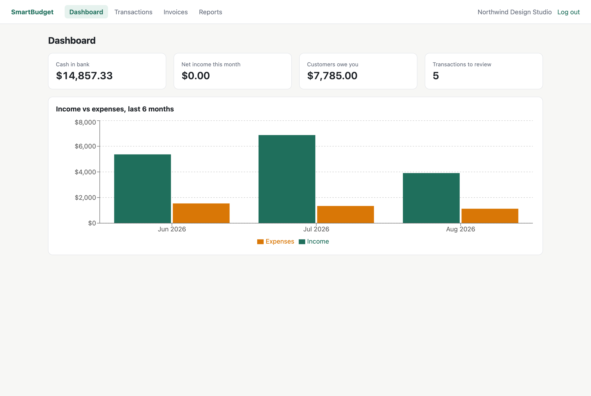
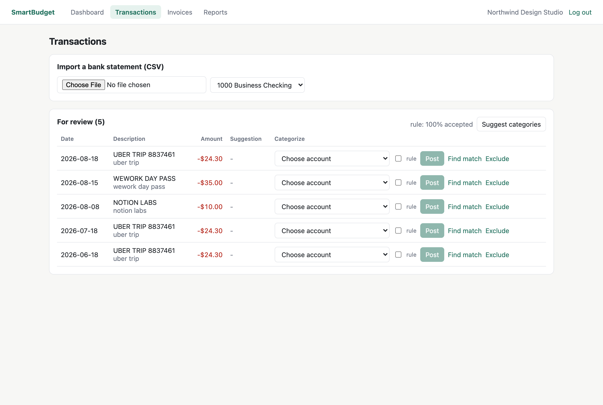
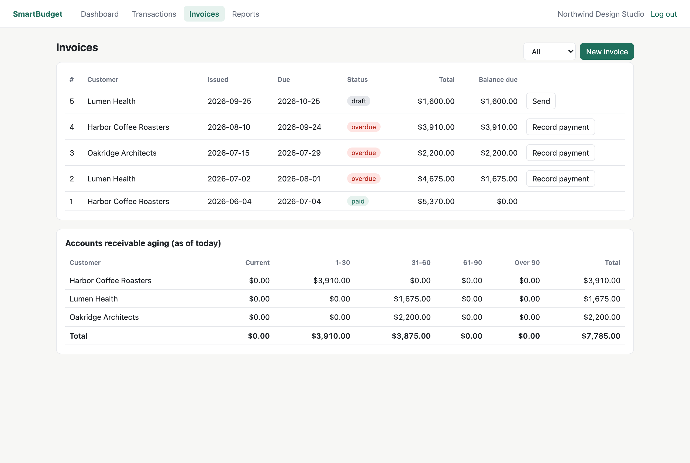
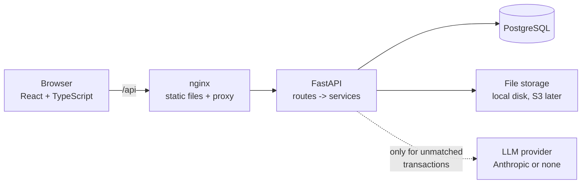

# SmartBudget

Double-entry bookkeeping for freelancers and very small businesses: import bank statements,
categorize transactions (rules first, an LLM only for what's left), send invoices, track what
customers owe, reconcile against the bank, and read a profit & loss, balance sheet and cash
flow built straight from the ledger.

Built as a portfolio project to practice the parts of accounting software that have to be
exactly right: money precision, a ledger that always balances, idempotent imports and strict
tenant isolation. Product ideas are inspired by mainstream small-business accounting tools;
no code, text or branding is copied from them.

**Live demo:** https://smartbudget-vert-ten.vercel.app (log in with `demo@smartbudget.dev` /
`demo-password`; it's a shared demo account, so other visitors may have changed its data).



## What it does

- **Chart of accounts and ledger.** Every financial event is a journal entry whose lines sum
  to zero. Posted entries can't be edited or deleted; mistakes are fixed with reversing
  entries.
- **Bank CSV import.** Column mapping with a preview, a per-row error report, vendor name
  cleanup, and duplicate detection: importing the same file again adds nothing.
- **Categorization.** User rules (e.g. description contains "aws" -> Software), then a
  per-organization vendor cache, then an LLM for anything still unmatched. Nothing is posted
  until a person accepts it. Acceptance rate is tracked per source.
- **Invoices and accounts receivable.** Drafts, sending (posts to AR and income), partial
  payments, computed overdue status, and an AR aging report that ties out to the ledger.
- **Reports.** Profit & loss, balance sheet and cash flow summary for any dates, computed with
  SQL aggregation over the ledger.
- **Reconciliation.** Match bank lines to entries already in the ledger (no double counting),
  compare a statement balance with the ledger, and list what explains the difference.
- **Multi-tenant.** Every row belongs to an organization; users only see organizations they
  are members of.

| Review queue | Invoices and AR aging |
| --- | --- |
|  |  |

## Architecture



The backend is layered so business rules live in one place:

- `app/api/` - HTTP only: parse the request, call a service, shape the response. One
  dependency, `get_org_context`, checks organization membership for every org-scoped route.
- `app/services/` - all business logic. `ledger_service.record_entry` is the only code that
  creates journal entries; bank categorization, invoices and payments all go through it.
  Services raise plain Python errors, which `app/main.py` maps to HTTP status codes.
- `app/models/` - SQLAlchemy 2.0 models; `app/schemas/` - Pydantic request/response bodies.
- `alembic/` - migrations; the test suite applies them to a real Postgres on every run.

Storage and the LLM sit behind small interfaces (`FileStorage`, `CategorySuggester`), so the
planned AWS deployment (S3 for uploads, Secrets Manager for keys) means adding
implementations, not changing the import or categorization code.

## Data model


Every table except `users` has an `org_id`; the full column list is in `backend/app/models/`.

## Quick start

Requirements: Docker.

```bash
docker compose up --build -d
docker compose exec api python -m app.scripts.seed
```

- App: http://localhost:8080, log in as `demo@smartbudget.dev` / `demo-password` (a local
  demo account created by the seed script).
- Interactive API docs: http://localhost:8080/api/docs

### Deployment

The live demo runs on Vercel: the React build is served as static files, the FastAPI app runs
as a Python serverless function behind `/api` (`api/index.py`, `vercel.json`), and the
database is Neon Postgres. Production deploys run database migrations as a build step
(`scripts/vercel-build.sh`).

### Local development

Requirements: Python 3.11+, Node 22, Docker (for Postgres).

```bash
docker compose up -d --wait db                       # dev Postgres on port 5434
docker compose --profile test up -d --wait db_test   # test Postgres on port 5435

cd backend
python3 -m venv .venv && source .venv/bin/activate
pip install -e ".[dev]"
cp .env.example .env              # then set JWT_SECRET_KEY
alembic upgrade head
python -m app.scripts.seed        # optional demo data
uvicorn app.main:app --reload     # API docs: http://localhost:8000/api/docs

cd ../frontend
npm install
npm run dev                       # http://localhost:5173 (proxies /api to :8000)
```

### Tests and checks

```bash
cd backend && ruff check . && ruff format --check . && pytest
cd frontend && npm test && npm run build
```

GitHub Actions runs the same checks on every push, plus a Docker build of both images. The
backend suite has 153 tests, including a tenancy-isolation test for each resource type, and
the frontend has 17 unit tests for the money helpers. Tests never call a real LLM: they use a
fake provider.

### LLM suggestions (optional)

Off by default. To enable, set `LLM_PROVIDER=anthropic` and `ANTHROPIC_API_KEY` (and
optionally `LLM_MODEL`, default `claude-opus-5`). Only a transaction's description, cleaned
vendor name and direction (in/out) are sent, never amounts. The model's answers are validated:
only accounts of the same organization that can hold a category are accepted.

## API

REST API under `/api/v1`. Everything except signup and login is scoped to an organization:
`/api/v1/orgs/{org_id}/...`, and all amounts are integer cents. Full interactive docs (every
endpoint, request and response) are generated by FastAPI at `/api/docs` when the app is running.

## Design decisions

- **Double-entry ledger.** Every journal entry's lines sum to zero, checked in one service
  function that is the only way into the ledger. Posted entries are immutable; mistakes are
  fixed with reversing entries.
- **Money as integer cents.** No floats anywhere: `BIGINT` in Postgres, strict integers in the
  API, `Decimal` for CSV parsing, integer math in the browser.
- **Idempotent imports.** Each bank row gets a fingerprint, and a unique constraint with
  `ON CONFLICT DO NOTHING` means re-importing a file adds nothing, even with two uploads at once.
- **Tenant isolation.** Every row belongs to an organization, one dependency checks
  membership, and other organizations' URLs return 404 so their ids can't be probed.

The reasoning, alternatives and tradeoffs for each are in [docs/decisions.md](docs/decisions.md).

## Project layout

```
backend/
  app/api/        routes (thin)
  app/services/   business logic: ledger, import, categorization, invoices, reports, reconciliation
  app/models/     SQLAlchemy models
  app/schemas/    Pydantic request/response bodies
  app/scripts/    seed script
  alembic/        migrations
  tests/          pytest, against a real Postgres
frontend/
  src/pages/      dashboard, transactions, invoices, reports
  src/lib/        money and date helpers (with Vitest tests)
docs/
  decisions.md    design decisions and tradeoffs, stage by stage
  screenshots/
```
